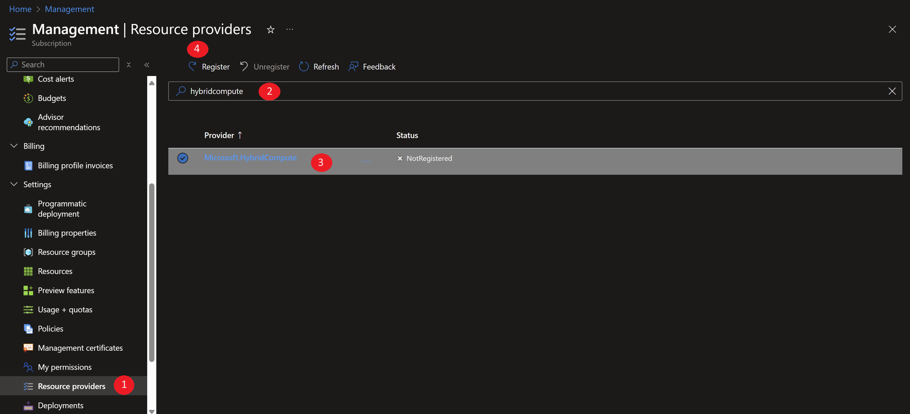

# Azure Arc Unleashed: Engage, Learn, and Master

Speakers: Jan Egil Ring & Seif Bassem

## Goals

In this immersive 90-minute session, participants will embark on a hands-on journey to explore the capabilities of Azure Arc-enabled Servers. Utilizing the Azure Arc Jumpstart resources, attendees will gain a deep understanding of how Azure Arc functions and its applications in a real-world scenario. The session is crafted to encourage active participation, enabling attendees to not only listen but also engage directly with the material through hands-on labs.

After completion of this session, you will be able to:

- Understand pre-requisites to onboard Windows and Linux servers to Azure Arc
- Onboard Windows and Linux servers running using different onboarding methods
- Query and inventory your Azure Arc-enabled servers using Azure Resource Graph
- Monitor your Azure Arc-enabled servers using Azure Monitor, Change Tracking and Inventory
- Keep your Azure Arc-enabled servers patched using Azure Update Manager
- SSH into your Azure Arc-enabled servers using SSH access
- Configure your Azure Arc-enabled servers using Azure Automanage machine configuration
- Manage the Windows operating system of your Arc-enabled servers using Windows Admin Center

## Prerequisites and Setup Information

All information for participating in this session can be found in [the session repository](https://aka.ms/arc-follow-along).

To save you time, please deploy the hands-on environment before coming to the session (if possible) as it takes ~10-25 minutes to get everything ready for the exercises. 

1. Register the following resource providers on your subscription using either cloud shell or the portal.

    

    ```shell
  az provider register --namespace Microsoft.HybridCompute --wait
  az provider register --namespace Microsoft.GuestConfiguration --wait
  az provider register --namespace Microsoft.AzureArcData --wait
  az provider register --namespace Microsoft.HybridConnectivity --wait
  az provider register --namespace Microsoft.OperationsManagement --wait
  az provider register --namespace Microsoft.SecurityInsights --wait
  ```

2. Click the <a href="https://portal.azure.com/#create/Microsoft.Template/uri/https%3A%2F%2Fraw.githubusercontent.com%2FAzure%2Farc_jumpstart_levelup%2Fpsconfeu%2Fazure_arc_servers_jumpstart%2FARM%2Fazuredeploy.json" target="_blank"></a> button and enter values for the the ARM template parameters to deploy the hands-on environment.
