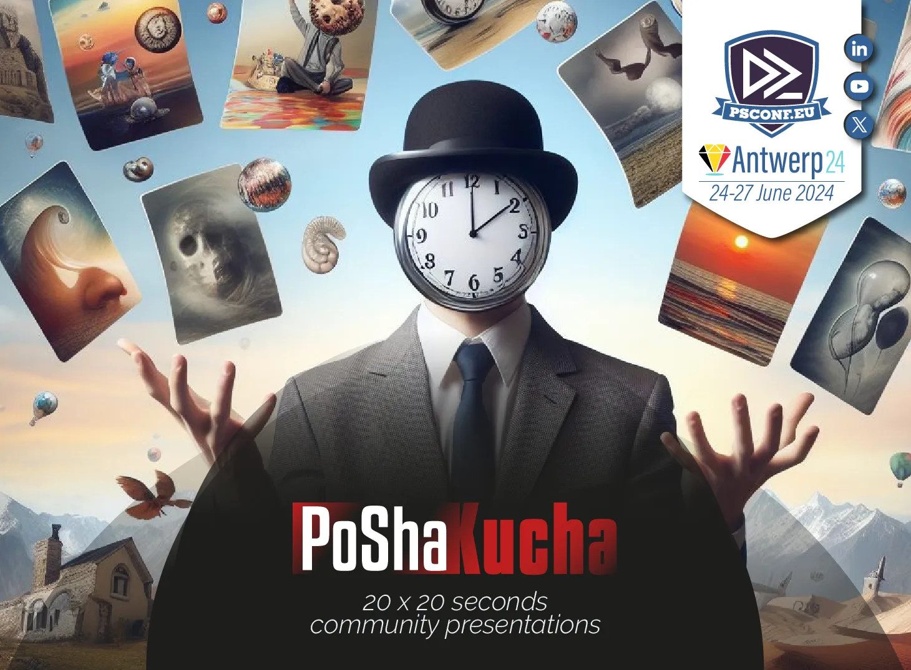

# about_Epochs

This is a preliminary version, **the PDF will be updated** and some code samples will be added when the recording from PSConfEU 2024 is available.
But have a look inside the document, you should find a lot of things you can try out and make your own experience.

**PoShaKucha** is a play on words derived from the term "PoSh" (for PowerShell) and "Pecha Kucha".
A [Pecha Kucha](https://en.wikipedia.org/wiki/PechaKucha) is an entertaining storytelling format, in which 20 images/slides are shown for 20 seconds each. A Pecha Kucha presentation will therefore always last 6 min 40 sec (plus or minus a few seconds), this also applies to a PoshaKucha.

